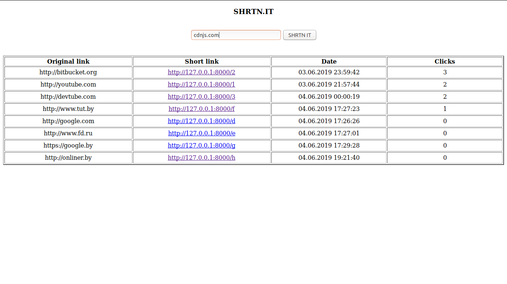
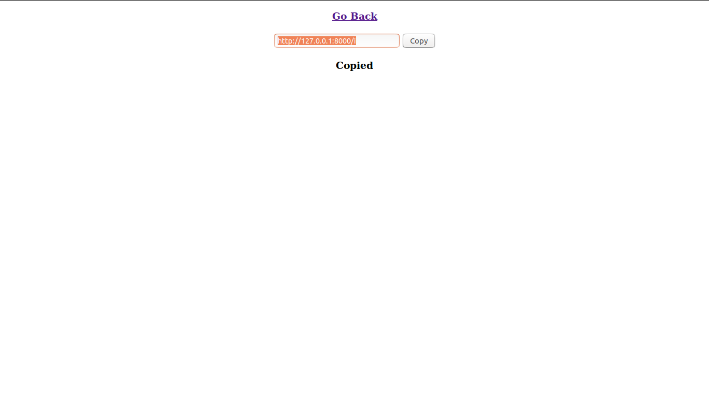

<h1>SHRTN.IT</h1>

<h1 align="center">The web service that shortens urls</h1>

The app accepts any URLs, saves to the database, encodes its id with "Base 62 encoding" algorithm and returns to the user.

<h2>Why?</h2>

URL shortening is used to create shorter aliases for long URLs. We call these shortened aliases “short links”. Users are redirected to the original URL when they hit these short links. Short links save a lot of space when displayed, printed, messaged, or tweeted. Additionally, users are less likely to mistype shorter URLs.

<h2>Demo</h2>
<ul>
  <li></li>
  <li></li>
</ul>
<h2>Built with</h2>
<ul>
  <li><a href="https://www.djangoproject.com/">Django</a> - The web framework used</li>
</ul>
