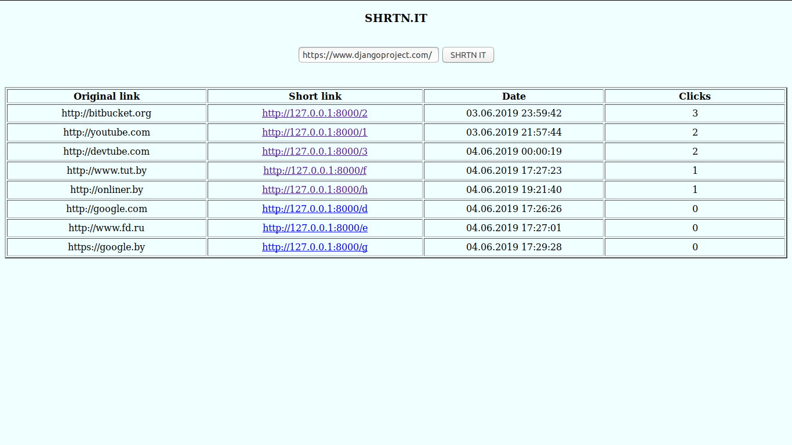
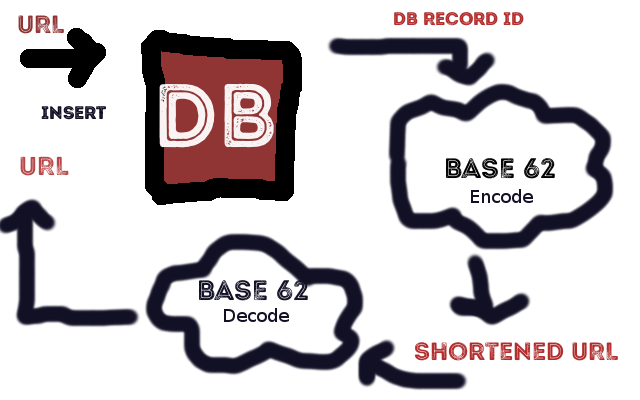

<h1>SHRTN.IT</h1>

<h1 align="center">The web service that shortens urls</h1>

The app accepts any URLs, saves to the database, encodes its id with "Base 62 encoding" algorithm and returns to the user.

<h2>Why?</h2>

URL shortening is used to create shorter aliases for long URLs. We call these shortened aliases “short links”. Users are redirected to the original URL when they hit these short links. Short links save a lot of space when displayed, printed, messaged, or tweeted. Additionally, users are less likely to mistype shorter URLs.

<h2>Demo</h2>
  
<h2>Key system</h2>
  
<h2>For developers</h2>

Clone the source locally:

<pre> 
      $ git clone https://github.com/alexshchegretsov/TMS_project_url_shortener.git
      $ cd TMS_project_url_shortener
</pre>

Update package list and install pip for Python 3:

<pre>
      $ sudo apt update
      $ sudo apt install python3-pip
</pre>

Once the installation is complete, verify the installation by checking the pip version:

<pre>
      $ pip3 --version
</pre>

You are still at TMS_project_url_shortener directory, create and run virtual environment:

<pre>
      $ virtualenv -p python3.7 .venv
      $ source .venv/bin/activate
</pre>
<h4>Install all dependencies from requirements.txt:</h4>
<pre>
      $ pip3 install -r requirements.txt
</pre>
<h2>Built with</h2>
<ul>
  <li><a href="https://www.djangoproject.com/">Django</a> - The web framework used</li>
</ul>
<h2>Author</h2>
<a href="#">Alex Shchegretsov</a>
<h2>License</h2>

MIT

