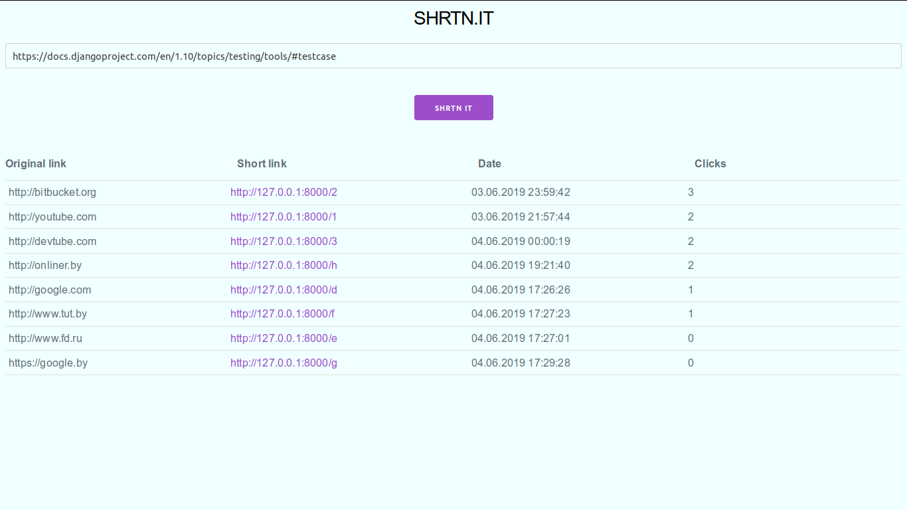
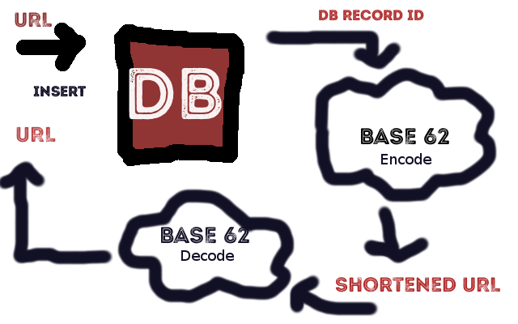

<h1>SHRTN.IT</h1>

<h1 align="center">The web service that shortens urls</h1>

The app accepts any URLs, saves to the database, encodes its id with "Base 62 encoding" algorithm and returns to the user.

<h2>Why?</h2>

URL shortening is used to create shorter aliases for long URLs. We call these shortened aliases “short links”. Users are redirected to the original URL when they hit these short links. Short links save a lot of space when displayed, printed, messaged, or tweeted. Additionally, users are less likely to mistype shorter URLs.

<h2>Demo</h2>
  
<h2>Scheme</h2>
  
<h2>How to run</h2>

Clone the source locally:

<pre> 
      $ git clone https://github.com/alexshchegretsov/URL_shortener.git
      $ cd URL_shortener
</pre>

Run containers with `docker-compose` tool:

<pre>
      $ docker-compose up -d
</pre>

Initialize postgres and collect staticfiles:

<pre>
      $ docker-compose run --rm web ./manage.py migrate
      $ docker-compose run --rm web ./manage.py collectstatic    (type "yes")
</pre>

Open your browser in a new window and go to localhost on 8000 port:

<pre>
      http://127.0.0.1:8000/
</pre>
<h2>Built with</h2>
<ul>
  <li><a href="https://www.djangoproject.com/">Django</a> - The web framework used</li>
  <li><a href="https://milligram.io/">Milligram</a> - A minimalist CSS framework</li>
</ul>
<h2>License</h2>

MIT &copy; <a href="https://github.com/alexshchegretsov">Alex Shchegretsov</a>

